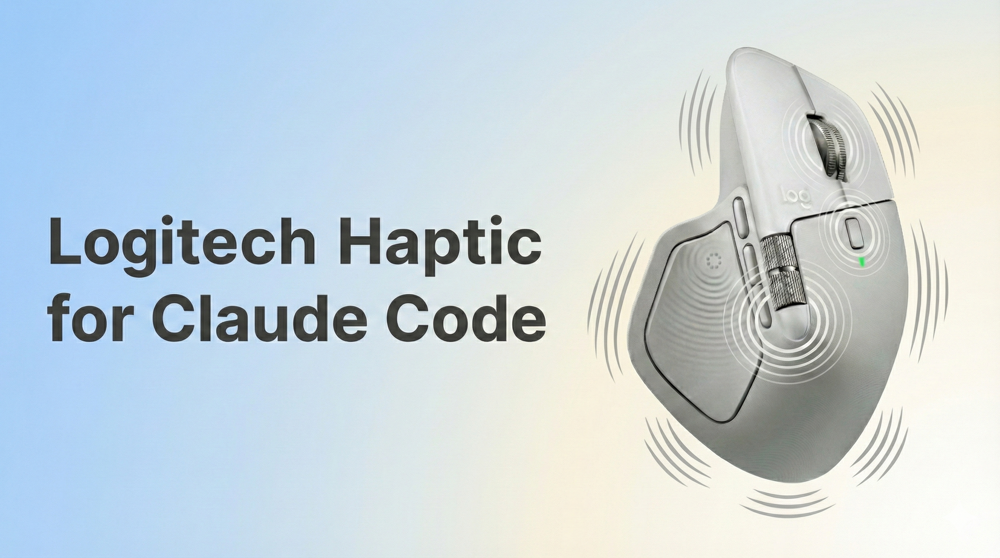

# Claude Code Haptic Feedback Plugin



A lightweight integration that delivers tactile notifications through your Logitech MX Master 4 mouse when Claude Code requires your attention or completes a task.

## Overview

When working with Claude Code, it's common to switch context while waiting for responses. This plugin solves the "tab-switching problem" by providing physical feedback directly through your mouse, eliminating the need to constantly monitor the terminal.

### How It Works

**macOS / Windows** (via Logi Options+):
```
Claude Code Event → Hook → Shell Script → HTTP API → HapticWebPlugin → Logi Options+ → MX Master 4
```

**Linux** (native HID++, no Logi Options+ required):
```
Claude Code Event → Hook → Shell Script → mx4-haptic.py → /dev/hidraw → Bolt Receiver → MX Master 4
```

1. Claude Code emits lifecycle events through its hook system
2. The hook triggers our shell script with event metadata
3. The script maps the event type to an appropriate haptic waveform
4. **On macOS/Windows:** an HTTP request is sent to the locally-running HapticWebPlugin → Logi Options+ activates the haptic motor
5. **On Linux:** `mx4-haptic.py` sends HID++ 2.0 commands directly to the Bolt receiver via `/dev/hidraw` — no Logi Options+ needed

### Supported Events

| Event | Haptic Pattern | Description |
|-------|----------------|-------------|
| Permission Request | `knock` | Claude needs authorization to execute a tool |
| Idle Prompt | `ringing` | Claude is waiting for user input (60+ seconds) |
| Task Complete | `completed` | Claude has finished responding |

## Prerequisites

| Requirement | macOS / Windows | Linux (native) |
|-------------|-----------------|-----------------|
| Hardware | Logitech MX Master 4 | Logitech MX Master 4 via Bolt receiver |
| Software | Logi Options+ | Python 3.6+ |
| Plugin | HapticWebPlugin | Not needed |
| System | bash, curl | bash, /dev/hidraw access |

## Installation

### Linux (native HID++ — no Logi Options+ needed)

The Linux version communicates directly with the MX Master 4 via HID++ 2.0 protocol through `/dev/hidraw`. No Logi Options+, no HapticWebPlugin, no HTTP — just a Python script talking to the Bolt receiver.

```bash
git clone https://github.com/aidarbn/claude-code-logitech-haptic-plugin.git
cd claude-code-logitech-haptic-plugin
./install.sh
```

**Test it:**
```bash
python3 scripts/mx4-haptic.py knock --debug
python3 scripts/mx4-haptic.py --list
```

**Permissions:** On most desktop Linux systems, udev + logind grant `/dev/hidraw*` access automatically via ACL. If you get a permission error:

```bash
sudo tee /etc/udev/rules.d/99-logitech-bolt.rules << 'EOF'
KERNEL=="hidraw*", ATTRS{idVendor}=="046d", ATTRS{idProduct}=="c548", MODE="0660", TAG+="uaccess"
EOF
sudo udevadm control --reload-rules && sudo udevadm trigger
```

### macOS / Windows (via Logi Options+)

#### Step 1: Install HapticWebPlugin

HapticWebPlugin is a third-party Logi Options+ plugin that exposes the MX Master 4 haptic motor through a local HTTPS API. This bridge is necessary because Logitech does not provide a public API for haptic control.

The plugin is included in this repository under the `plugin/` directory. It is sourced from [Fallstop/HapticWebPlugin](https://github.com/Fallstop/HapticWebPlugin).

**Manual Installation**

1. Open Logitech Options+ and click on your MX Master 4
2. In the left sidebar, open the **HAPTIC FEEDBACK** tab and click on the haptic feedback settings popover
3. In the new right sidebar, click the **INSTALL AND UNINSTALL PLUGINS** button to open the plugin management window
4. Locate the `HapticWeb.lplug4` file in the `plugin/` directory of this repository and double-click it
5. This will trigger an installation dialogue in Logitech Options+. Return to the application and press **Continue**

To verify the installation, open [haptics.jmw.nz/playground](https://haptics.jmw.nz/playground) and trigger any waveform. Your mouse should vibrate.

#### Step 2: Install the Claude Code Plugin

Choose your operating system:

<details>
<summary><b>macOS</b></summary>

#### Prerequisites
- Git (included with Xcode Command Line Tools)
- curl (included in macOS)

#### Installation

```bash
# Clone the repository
git clone https://github.com/ChefJodlak/claude-code-logitech-haptic-plugin.git
cd claude-code-logitech-haptic-plugin

# Run the installer
./install.sh
```

#### Optional: Install jq for proper settings merging
```bash
brew install jq
```

</details>

<details>
<summary><b>Linux (Ubuntu/Debian)</b></summary>

#### Prerequisites
```bash
sudo apt update
sudo apt install git curl
```

#### Installation

```bash
# Clone the repository
git clone https://github.com/ChefJodlak/claude-code-logitech-haptic-plugin.git
cd claude-code-logitech-haptic-plugin

# Run the installer
./install.sh
```

#### Optional: Install jq for proper settings merging
```bash
sudo apt install jq
```

</details>

<details>
<summary><b>Linux (Fedora/RHEL)</b></summary>

#### Prerequisites
```bash
sudo dnf install git curl
```

#### Installation

```bash
# Clone the repository
git clone https://github.com/ChefJodlak/claude-code-logitech-haptic-plugin.git
cd claude-code-logitech-haptic-plugin

# Run the installer
./install.sh
```

#### Optional: Install jq for proper settings merging
```bash
sudo dnf install jq
```

</details>

<details>
<summary><b>Windows (Git Bash)</b></summary>

#### Prerequisites
1. Install [Git for Windows](https://git-scm.com/download/win) (includes Git Bash and curl)
2. Ensure Logi Options+ is installed and running

#### Installation

Open **Git Bash** and run:

```bash
# Clone the repository
git clone https://github.com/ChefJodlak/claude-code-logitech-haptic-plugin.git
cd claude-code-logitech-haptic-plugin

# Run the installer
./install.sh
```

#### Optional: Install jq for proper settings merging

Using [Chocolatey](https://chocolatey.org/):
```powershell
choco install jq
```

Using [Scoop](https://scoop.sh/):
```powershell
scoop install jq
```

</details>

<details>
<summary><b>Windows (WSL - Windows Subsystem for Linux)</b></summary>

#### Prerequisites
1. [Install WSL](https://learn.microsoft.com/en-us/windows/wsl/install) with Ubuntu or your preferred distribution
2. Ensure Logi Options+ is installed on Windows (not inside WSL)

#### Installation

Open your WSL terminal and run:

```bash
# Install dependencies
sudo apt update
sudo apt install git curl

# Clone the repository
git clone https://github.com/ChefJodlak/claude-code-logitech-haptic-plugin.git
cd claude-code-logitech-haptic-plugin

# Run the installer
./install.sh
```

#### Optional: Install jq for proper settings merging
```bash
sudo apt install jq
```

> **Note:** The haptic API runs on Windows, but WSL can communicate with it via localhost.

</details>

<details>
<summary><b>Windows (MSYS2)</b></summary>

#### Prerequisites
1. Install [MSYS2](https://www.msys2.org/)
2. Open MSYS2 MINGW64 terminal

#### Installation

```bash
# Install dependencies
pacman -S git curl

# Clone the repository
git clone https://github.com/ChefJodlak/claude-code-logitech-haptic-plugin.git
cd claude-code-logitech-haptic-plugin

# Run the installer
./install.sh
```

#### Optional: Install jq for proper settings merging
```bash
pacman -S jq
```

</details>

---

The installer automatically:
- Detects your operating system
- Validates HapticWebPlugin connectivity
- Creates the hooks directory at `~/.claude/hooks/`
- Installs the haptic trigger script
- Configures Claude Code hooks in `~/.claude/settings.json`
- Runs a test vibration to confirm functionality

### Step 3: Restart Claude Code

Claude Code loads hook configurations at startup. Restart any active sessions to enable haptic feedback.

## Uninstallation

```bash
./uninstall.sh
```

This removes the haptic script and cleans up hook entries from your settings file.

## Configuration

### Customizing Waveforms

Edit `~/.claude/hooks/haptic-trigger.sh` to modify the waveform assignments:

```bash
WAVEFORM_PERMISSION="knock"      # Permission request notifications
WAVEFORM_IDLE="ringing"          # Idle input prompts
WAVEFORM_COMPLETE="completed"    # Task completion signals
```

### Available Waveforms

The HapticWebPlugin exposes 15 distinct haptic patterns:

**Precision Feedback**
- `sharp_collision` - Sharp, immediate feedback
- `damp_collision` - Muted collision sensation
- `subtle_collision` - Gentle touch feedback
- `damp_state_change` - Soft state transition

**Progress Indicators**
- `sharp_state_change` - Crisp state transition
- `completed` - Satisfying completion pulse
- `firework` - Celebratory burst pattern
- `happy_alert` - Positive notification
- `wave` - Rolling wave sensation
- `angry_alert` - Urgent attention signal
- `mad` - Intense alert pattern
- `square` - Uniform pulse

**Incoming Events**
- `knock` - Door knock simulation
- `ringing` - Phone ring pattern
- `jingle` - Musical chime

### Adjusting Intensity

Haptic strength is controlled globally through Logi Options+:

1. Open Logi Options+
2. Select your MX Master 4
3. Navigate to **Haptic Feedback** settings
4. Adjust the **Strength** slider (Subtle, Low, Medium, High)

Note: Intensity cannot be controlled programmatically through the API.

## Troubleshooting

### Haptic feedback not working

1. **Verify HapticWebPlugin is running**
   ```bash
   curl -s https://local.jmw.nz:41443/
   ```
   Expected: JSON response with service information

2. **Test haptic API directly**
   ```bash
   curl -X POST -d "" https://local.jmw.nz:41443/haptic/completed
   ```
   Expected: Mouse vibrates

3. **Check Logi Options+ status**
   - Ensure Logi Options+ is running
   - Verify MX Master 4 is connected and selected
   - Confirm HapticWebPlugin appears in installed plugins

### Hooks not triggering

1. **Verify hook script exists**
   ```bash
   ls -la ~/.claude/hooks/haptic-trigger.sh
   ```

2. **Check hook configuration**
   ```bash
   cat ~/.claude/settings.json | grep -A 20 '"hooks"'
   ```

3. **Test hook script manually**
   ```bash
   echo '{"hook_event_name": "Stop"}' | ~/.claude/hooks/haptic-trigger.sh
   ```

4. **Restart Claude Code**

   Hooks are loaded at session start. New configurations require a restart.

### Permission errors

Ensure the hook script is executable:
```bash
chmod +x ~/.claude/hooks/haptic-trigger.sh
```

## Technical Details

### Hook Configuration

The plugin registers two Claude Code hooks in `~/.claude/settings.json`:

```json
{
  "hooks": {
    "Notification": [
      {
        "matcher": "permission_prompt|idle_prompt",
        "hooks": [
          {
            "type": "command",
            "command": "~/.claude/hooks/haptic-trigger.sh"
          }
        ]
      }
    ],
    "Stop": [
      {
        "hooks": [
          {
            "type": "command",
            "command": "~/.claude/hooks/haptic-trigger.sh"
          }
        ]
      }
    ]
  }
}
```

### Hook Input Schema

Claude Code provides JSON metadata via stdin:

```json
{
  "session_id": "abc123",
  "hook_event_name": "Notification",
  "notification_type": "permission_prompt",
  "cwd": "/path/to/project",
  "transcript_path": "/path/to/transcript.jsonl"
}
```

### API Reference

HapticWebPlugin exposes the following endpoints:

| Endpoint | Method | Description |
|----------|--------|-------------|
| `/` | GET | Health check and service info |
| `/waveforms` | GET | List available haptic patterns |
| `/haptic/{waveform}` | POST | Trigger specified waveform |

WebSocket connections are also supported at `wss://local.jmw.nz:41443/ws` for lower-latency applications.

## Project Structure

```
claude-code-logitech-haptic-plugin/
├── README.md                    Documentation
├── install.sh                   Installation script
├── uninstall.sh                 Removal script
├── plugin/
│   └── HapticWeb.lplug4         Logi Options+ haptic plugin (macOS/Windows)
└── scripts/
    ├── haptic-trigger.sh        Hook handler (auto-detects Linux vs macOS/Windows)
    └── mx4-haptic.py            Native Linux HID++ haptic driver
```

## Dependencies

| Dependency | Purpose | Installation |
|------------|---------|--------------|
| curl | HTTP requests to HapticWebPlugin | Included in macOS/Linux; Windows: included in Git Bash |
| jq | JSON parsing for settings merge | See below (optional) |
| bash | Script execution | Included in macOS/Linux; Windows: Git Bash, MSYS2, or WSL |

### Installing jq (optional but recommended)

| Platform | Command |
|----------|---------|
| macOS | `brew install jq` |
| Linux (Debian/Ubuntu) | `sudo apt install jq` |
| Linux (Fedora/RHEL) | `sudo dnf install jq` |
| Windows (Chocolatey) | `choco install jq` |
| Windows (Scoop) | `scoop install jq` |

The `jq` utility is optional but recommended. Without it, the installer will overwrite existing settings rather than merge configurations.

## Limitations

- **Select options (elicitation dialogs) do not trigger haptic feedback** - Due to a Claude Code limitation, the `elicitation_dialog` notification type is not emitted through the hook system when Claude presents selection options to the user. Only permission prompts, idle prompts, and task completion events trigger haptic feedback.
- Haptic intensity cannot be controlled per-event (Logi Options+ global setting only)
- **macOS/Windows:** Requires HapticWebPlugin to be running (starts automatically with Logi Options+)
- **Linux:** Requires Bolt USB receiver (Bluetooth not yet supported for HID++ haptic)

## Third-Party Components

This project includes [HapticWebPlugin](https://github.com/Fallstop/HapticWebPlugin) by Fallstop, which provides the local API bridge for MX Master 4 haptic control. The plugin file is distributed under its original license terms.

## References

- [HapticWebPlugin](https://github.com/Fallstop/HapticWebPlugin) - Local haptic API bridge (included in `plugin/` directory)
- [MyrikLD/mx4hyprland](https://github.com/MyrikLD/mx4hyprland) - Original Linux HID++ haptic implementation
- [lukasfri/mx4notifications](https://github.com/lukasfri/mx4notifications) - Haptic on desktop notifications
- [Claude Code Hooks Documentation](https://code.claude.com/docs/en/hooks) - Hook system reference
- [Logi Actions SDK](https://logitech.github.io/actions-sdk-docs/) - Logitech plugin development
- [MX Master 4 Haptics](https://www.logitech.com/en-us/software/logi-options-plus/haptics.html) - Official haptic information

## License

MIT License

Copyright (c) 2025

Permission is hereby granted, free of charge, to any person obtaining a copy of this software and associated documentation files (the "Software"), to deal in the Software without restriction, including without limitation the rights to use, copy, modify, merge, publish, distribute, sublicense, and/or sell copies of the Software, and to permit persons to whom the Software is furnished to do so, subject to the following conditions:

The above copyright notice and this permission notice shall be included in all copies or substantial portions of the Software.

THE SOFTWARE IS PROVIDED "AS IS", WITHOUT WARRANTY OF ANY KIND, EXPRESS OR IMPLIED, INCLUDING BUT NOT LIMITED TO THE WARRANTIES OF MERCHANTABILITY, FITNESS FOR A PARTICULAR PURPOSE AND NONINFRINGEMENT. IN NO EVENT SHALL THE AUTHORS OR COPYRIGHT HOLDERS BE LIABLE FOR ANY CLAIM, DAMAGES OR OTHER LIABILITY, WHETHER IN AN ACTION OF CONTRACT, TORT OR OTHERWISE, ARISING FROM, OUT OF OR IN CONNECTION WITH THE SOFTWARE OR THE USE OR OTHER DEALINGS IN THE SOFTWARE.
